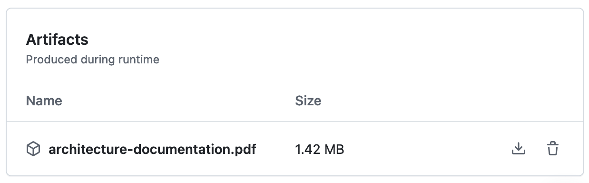

# what2eat

Sample app for demonstrating architecture design in SWAR lecture (HTWG WIN)

## Getting started

- Create an account at [WeatherBit](https://www.weatherbit.io/) and note the API key
- In `src/main/resources`, **copy** (not rename) the file `weatherbit.sample.properties` to `weatherbit.properties` and
  enter the API key
- Start the application by running `src/main/java/de/schneider21/what2eat/Application.java`

## Architecture documentation

This branch contains an [architecture documentation](doc/architecture-documentation.md) that is based on the [ADF documentation template](https://github.com/architecture-decomposition-framework/adf-documentation-template/) in version 1.0.0.

A PDF version of this documentation is automatically generated from the the Markdown version and can be downloaded by opening <https://github.com/neshanjo/what2eat/actions/workflows/markdown-to-pdf.yml>, clicking on the most recent successful run and then scrolling down to the bottom of the page:

