# What2Eat - Architecture documentation <!-- omit in toc -->

Based on version 1.0.0 of the [ADF documentation template](https://github.com/architecture-decomposition-framework/adf-documentation-template).

## Table of contents <!-- omit in toc -->

- [1. Introduction](#1-introduction)
  - [1.1. Business context](#11-business-context)
  - [1.2. System overview](#12-system-overview)
  - [1.3. Constraints](#13-constraints)
  - [1.4. Stakeholders](#14-stakeholders)
  - [1.5. Document goals](#15-document-goals)
- [2. System context and domain](#2-system-context-and-domain)
  - [2.1. System context delineation](#21-system-context-delineation)
  - [2.2. Domain model](#22-domain-model)
- [3. Architecture drivers (function and quality)](#3-architecture-drivers-function-and-quality)
  - [3.1. Key functional requirements](#31-key-functional-requirements)
  - [3.2. Quality attributes](#32-quality-attributes)
- [4. System decomposition](#4-system-decomposition)
  - [4.1. Solution approach and key architecture decisions](#41-solution-approach-and-key-architecture-decisions)
  - [4.2. System domains](#42-system-domains)
  - [4.3. System structure](#43-system-structure)
  - [4.4. Data model](#44-data-model)
  - [4.5. Code organization (mapping runtime to devtime)](#45-code-organization-mapping-runtime-to-devtime)
  - [4.6. Build Process](#46-build-process)
  - [4.7. Deployment and Operation](#47-deployment-and-operation)
  - [4.8. Technologies](#48-technologies)
    - [4.8.1. Architecture drivers](#481-architecture-drivers)
    - [4.8.2. Solution idea](#482-solution-idea)
    - [4.8.3. Design decisions](#483-design-decisions)
    - [4.8.4. Discarded alternatives](#484-discarded-alternatives)
- [5. Quality concepts](#5-quality-concepts)
  - [5.1. Testability concept](#51-testability-concept)
    - [5.1.1. Architecture drivers](#511-architecture-drivers)
    - [5.1.2. Solution Idea](#512-solution-idea)
    - [5.1.3. Design decisions](#513-design-decisions)
    - [5.1.4. Discarded alternatives](#514-discarded-alternatives)
  - [5.2. Caching concept](#52-caching-concept)
    - [5.2.1. Architecture drivers](#521-architecture-drivers)
    - [5.2.2. Solution idea](#522-solution-idea)
    - [5.2.3. Design decisions](#523-design-decisions)
    - [5.2.4. Discarded alternatives](#524-discarded-alternatives)
- [6. Risks and technical debt](#6-risks-and-technical-debt)
- [7. Outlook and future plans](#7-outlook-and-future-plans)
- [8. Glossary](#8-glossary)

## 1. Introduction

What2Eat is a simple app for showing the meal of the day at the cafeteria of the university of Kaiserslautern. It serves as an example for illustrating architecture design (part of the lecture "SWAR-WIN: Softwarearchitektur" by Prof. Dr. Johannes C. Schneider from [HTWG Konstanz](https://www.htwg-konstanz.de/)).

### 1.1. Business context

The following "business" goals have been identified for this project:

**G1.** System should serve as an educational example to show design process and application of architectural styles and patterns.

**G2.** Students with WebTech-Knowledge should be able to implement the Web UI part.

### 1.2. System overview

The purpose of the system is on the one hand to offer certain functionality (cafeteria menu with cold bowl probability, as explained in later sections), but on the other hand (and much more important!), to serve as an easily comprehensible example for the target group (WIN students).

Furthermore, while a real world application would consist of a frontend and server part, this documentation focuses on the server part which uses Java - a technology WIN students are familiar with.

### 1.3. Constraints

The following constraints have been identified:

**C1.** The cafeteria web page is slow and not optimized for smart phone usage.

**C2.** WIN students should be familiar with system's main technology stack, in particular they should have practical experience with the programming language.

**C3.** Based on a analysis using a sample size of 10 meals during different weather conditions, a (self-called) data scientist came up with the following formula to calculate the probability of cold bowl serving:

- Let x be the forecast temperature for the day at 12 o'clock and p be the probability that a cold bowl is served:
  - If x < 20°C, then p = 0%.
  - If 20°C ≤ x ≤ 30°C, then p = (x – 20)⋅10%
    Example: x = 23.7°C means p = 37%
  - If x ≥ 30°C, then p = 100%.

**C4.** All external services used by the system must be free to use.

### 1.4. Stakeholders

Stakeholders of this project and system are

- the teacher of the lecture _Software-Architektur_ (project lead),
- attendants of the lecture _Software-Architektur_, WIN and GIB students ("users" in terms of learning about software architecture) and
- potential cafeteria customers (end users).

### 1.5. Document goals

The intent of this documents on one side is to give an example for a software documentation. On the other side, it should illustrate the architecture of the system. The main target group for this documentation are the attendants of the lecture _Software-Architektur_.

This document represents the system's state as implemented in branch `with-cache` in the [What2Eat GitHub repository](https://github.com/neshanjo/what2eat). The implementation covers only the backend part of the system. Also this document is mainly describing the backend part of the system.

## 2. System context and domain

The system relies on data that is queried by external system. The following sections give more information about the scope of the architecture and the main data used within the system.

### 2.1. System context delineation

The system scope and context has been identified as follows:

There is a single user type interacting with the system. Decisions have been made to use weather and menu data from external systems. Entering menu data manually was discarded since it requires continuos work at least twice a month by an operating person as the meals are only available two week in advance. Another idea of using a self-built weather station to measure and predict the temperature was discarded since there are free weather services with a more precise forecast.

### 2.2. Domain model

In the following figure, the main data used in the system is depicted.

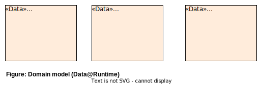

The data model is refined further in the section [4.3. Data model](#44-data-model).

## 3. Architecture drivers (function and quality)

Software architecture is driven by business goals, constraints, functional requirements and quality attributes of the system. The first two types can be found in [1.1. Business Context](#11-business-context) and [1.3. Constraints](#13-constraints), while the latter two types of drivers are described in this chapter.

### 3.1. Key functional requirements

The key functional requirements are given in the form of user stories.

F1. As a hungry student, I would like to know what meals are offered today in the cafeteria without having to go there in order to decide if I go to the cafeteria or bring my own food.

F2. As a hungry student, I would like to know what today‘s meals in the cafeteria cost without having to go there in order to decide if I go to the cafeteria or prefer something cheaper from the local bakery of kebap place.

F3. As a hungry student, I would like to know if there will be a cold bowl (see [8. Glossary](#8-glossary)) offered in the cafeteria because then I don't have to buy a drink. (Note: This information is not shown on the cafeteria menu and cannot be seen unless actually queuing for the meal)

### 3.2. Quality attributes

Quality attributes are described in form of the architecture scenario template. Status and Priority are omitted.

> Technical note: The scenarios are given as Markdown tables which is a widely supported Markdown extension. However, they can also be specified with plain text and bullet points, which makes them easier to read and edit in the raw Markdown format. An example is given here:

#### 3.2.1. Development start time (Q.EasyDevStart) <!-- omit in toc -->

- Environment: A developer has a computer with working internet connection. Java version J is installed, IntelliJ version I, git version G and Maven version M installed. The developer is registered at <https://www.weatherbit.io/> and in possession of a valid API key.
  - Internet bandwidth &ge; 1 MBit/s, J &ge; 11, I &ge; 2021.3, G &ge; 2.33, M &ge; 3.8
- Stimulus: The developer wants to checkout and run the project for local testing.
- Response: The system is running and answering the first request in T
  - T &le; 5 minutes

| Categorization  |                                                                                                                                                                                                                                                              |                                                                                     |
| --------------- | ------------------------------------------------------------------------------------------------------------------------------------------------------------------------------------------------------------------------------------------------------------ | ----------------------------------------------------------------------------------- |
| Scenario Name     | Development start time                                                                                                                                                                                                                                       |
| Scenario ID       | Q.EasyDevStart                                                                                                                                                                                                                                               |
| **Description** |                                                                                                                                                                                                                                                              | **Quantification**                                                                  |
| Environment     | A developer has a computer with working internet connection. Java version J is installed, IntelliJ version I, git version G and Maven version M installed. The developer is registered at <https://www.weatherbit.io/> and in possession of a valid API key. | Internet bandwidth &ge; 1 MBit/s, J &ge; 11, I &ge; 2021.3, G &ge; 2.33, M &ge; 3.8 |
| Stimulus        | The developer wants to checkout and run the project for local testing.                                                                                                                                                                                       |
| Response        | The system is running and answering the first request in T.                                                                                                                                                                                                  | T &le; 5 minutes                                                                    |

| Categorization  |                                                                                |                    |
| --------------- | ------------------------------------------------------------------------------ | ------------------ |
| Scenario Name     | Code comprehensibility                                                         |
|                 |
| Scenario ID       | Q.Comprehensibility                                                            |
| **Description** |                                                                                | **Quantification** |
| Environment     | A WIN student in semester S has checked out the project and started the system | S &ge; 6           |
| Stimulus        | The student executes a function of the system.                                 |                    |
| Response        | The student can find the code responsible for implementing the function in T.       | T &le; 5 minutes   |

| Categorization  |                                                                                                                |                    |
| --------------- | -------------------------------------------------------------------------------------------------------------- | ------------------ |
| Scenario Name     | Package Size                                                                                                   |
|                 |
| Scenario ID       | Q.Size                                                                                                         |
| **Description** |                                                                                                                | **Quantification** |
| Environment     | The code is ready for a new deployment.                                                                        |                    |
| Stimulus        | A new deployment artifact is built to update the production app.                                               |                    |
| Response        | In order to make the deployment from places with weak internet connection, the deployment artifact has size S. | S &le; 3 MB        |

| Categorization  |                                                                     |                                                                                                                                                                                                                                                                                                                   |
| --------------- | ------------------------------------------------------------------- | ----------------------------------------------------------------------------------------------------------------------------------------------------------------------------------------------------------------------------------------------------------------------------------------------------------------- |
| Scenario Name     | Simple one-user educational system                                  |
|                 |
| Scenario ID       | Q.Performance.Threads                                               |
| **Description** |                                                                     | **Quantification**                                                                                                                                                                                                                                                                                                |
| Environment     | The system is running.                                              | S &ge; 6                                                                                                                                                                                                                                                                                                          |
| Stimulus        | The system gets x parallel requests                                 | x = 1 (_simple educational system, no parallelism required!_)                                                                                                                                                                                                                                                     |
| Response        | The system is able to handle the requests without noticeable delay. | If x > 1, the second, third, ... requests gets a response with at most 10ms delay compared to the first request (_Since x == 1, the case x > 1 will not occur in this simple system. This is just an example how a parallelism driver could be formulated, given that the system should handle parallel request_) |

| Categorization  |                                                                                  |                                                  |
| --------------- | -------------------------------------------------------------------------------- | ------------------------------------------------ |
| Scenario Name     | (Almost) instant meal display                                                    |
|                 |
| Scenario ID       | Q.Performance.Response                                                           |
| **Description** |                                                                                  | **Quantification**                               |
| Environment     | The system is running. The cafeteria is open on the current day.                 | S &ge; 6                                         |
| Stimulus        | A user requests the meal(s) of today.                                            |                                                  |
| Response        | The system shows the meal(s) of today along with the cold bowl probability in T. | T &le; 200 ms for 99 of 100 consecutive requests |

| Categorization  |                                                                                                                                                                                     |                                    |
| --------------- | ----------------------------------------------------------------------------------------------------------------------------------------------------------------------------------- | ---------------------------------- |
| Scenario Name     | Offline testability                                                                                                                                                                 |
|                 |
| Scenario ID       | Q.Testability.Offline                                                                                                                                                               |
| **Description** |                                                                                                                                                                                     | **Quantification**                 |
| Environment     | A developer has set up the project for local development and testing. There is internet connection on the computer. The developer executes all unit and module tests. x tests pass. | x = number of passed tests         |
| Stimulus        | The developer goes offline and executes unit and module tests again.                                                                                                                | Internet bandwidth = 0 Mbit/s      |
| Response        | The same x tests pass.                                                                                                                                                              | Number of passed tests is still x. |

| Categorization  |                                                                                                       |                                                                    |
| --------------- | ----------------------------------------------------------------------------------------------------- | ------------------------------------------------------------------ |
| Scenario Name     | Weather testability                                                                                   |
|                 |
| Scenario ID       | Q.Testability.Weather                                                                                 |
| **Description** |                                                                                                       | **Quantification**                                                 |
| Environment     | A developer has set up the project for local development and testing. It is winter in Kaiserslautern. | temperature in Kaiserslautern < 20°C                               |
| Stimulus        | The developer wants to test for different cold bowl probability values.                               | cold bowl probability values 0%, 1%, 21%, 45%, 50%, 78%, 99%, 100% |
| Response        | The developer is able to write and execute tests that return the desired probability values.          |                                                                    |

## 4. System decomposition

During architecture design, the system has been decomposed with respect to different criteria, i.e. functional-driven, data-driven, deployment-driven and technology driven. The resulting architecture is described in the following sections.

### 4.1. Solution approach and key architecture decisions

The key design decision is to use different components for data display and data acquisition.

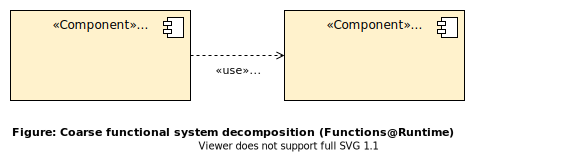

This concept is further refined by applying the client-server pattern, see [4.4. Deployment and Operation](#47-deployment-and-operation).

### 4.2. System domains

In this relatively small system, there is only one domain: Meal data. The other domain, weather data, is mainly handled in an external system.

### 4.3. System structure

The system is decomposed into several components that all have their own concerns.

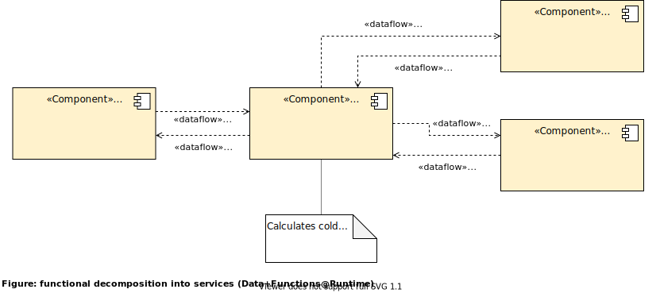

Design decisions:

- MealService as central service, WeatherService and MenuService as subservices that will query the external system.

### 4.4. Data model

The figure from the last section already illustrated the intended data flow between the components. This is the data model in more detail:

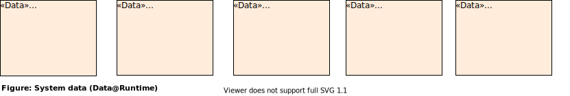

Design decisions:

- We have modelled separate data entities for query and response.

### 4.5. Code organization (mapping runtime to devtime)

Components are mapped 1:1 to modules for realizing the components at devtime, see the following two figures.

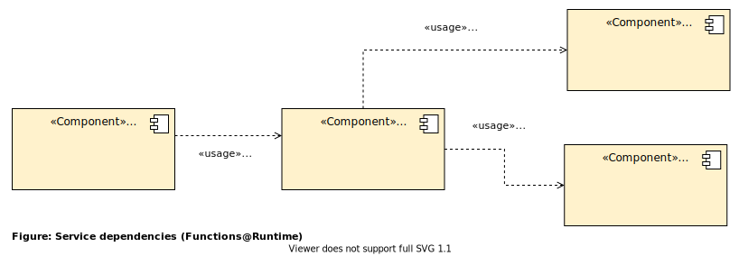

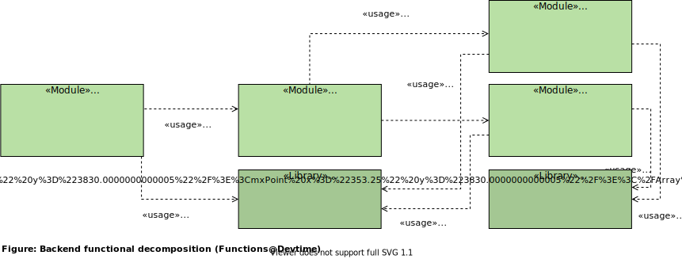

Note that the realization of the modules is done with the help of additional libraries.

Design decisions:

- The runtime decomposition already follows the principle of separation of concerns. This is continued at devtime by using the 1:1 mapping.

Discarded Alternatives:

- The modules are not split up any further since their functionality is already quite simple and limited.

### 4.6. Build Process

To build a releasable and deployable JAR file, the Maven package command can be used. However, currently, the system is built and run within IntelliJ IDE only and used for local testing and demonstration.

### 4.7. Deployment and Operation  

The system is decomposed into a client and a server part. These correspond to the Meal display and meal data acquisition components. During development, both client and server can be run on the same machine:

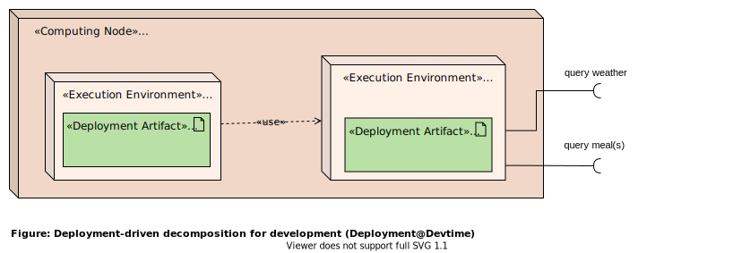

This will be the typical operation of the system, since it is only an educational example.

In the future, the server part could be deployed to a dedicated machine. Several clients could then access the server via the internet.

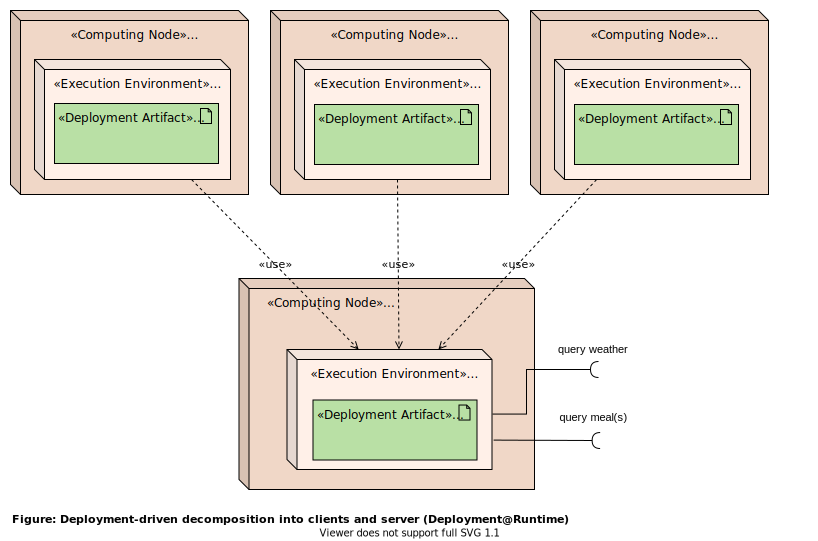

### 4.8. Technologies

The choice of technologies is cross-cutting concept and addresses certain drivers. Thus, we describe it here in a similar way as the quality concepts in the next chapter.

#### 4.8.1. Architecture drivers

The choice of technologies addresses the drivers _C2_, _C4_, _G2_, _Q.Comprehensibility_, _Q.Performance.Threads_, _Q.Size_

#### 4.8.2. Solution idea

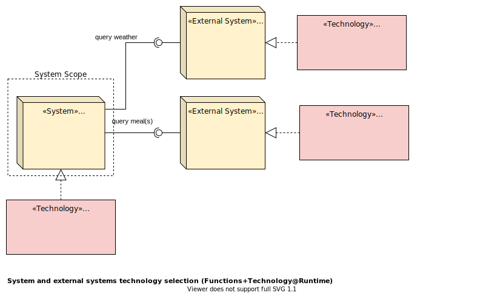

Regarding the backend part, we have chosen the following Java libraries:

- NanoHttpd, a simple HTTP server,
- Jackson, a JSON (de-)serialization library,
- okhttp, a REST client.

#### 4.8.3. Design decisions

We use

- Java since the WIN students are familiar with is,
- WeatherBit and mensa-kl.de since they are free to use (at least for the amount of calls we need in this project),
- NanoHttpd and implement the REST backend ourselves since it is very lightweight and offers the students the possibility to fully comprehend how REST requests can be handled with Java and
- Jackson for JSON (de-)serialization and okhttp as REST client since these libraries are widely used, well documented and comparatively easy to understand.

#### 4.8.4. Discarded alternatives

We do not use Spring Boot since it drastically increases learning curve and deployment size.

## 5. Quality concepts

When designing a system, there are many cross-cutting design decisions that affect the system as a whole. These decisions address certain architecture drivers form solution concepts which are described in the following sections.

### 5.1. Testability concept

#### 5.1.1. Architecture drivers

_Q.Testability.Offline_, _Q.Testability.Weather_

#### 5.1.2. Solution Idea

We need a mechanism that makes it easy to exchange the real weather and menu service with services that are adequate for offline testing and for using fake weather data. For the  system with the real service, a service factory facilitates the service instantiation.

The following figure illustrates these two concepts:

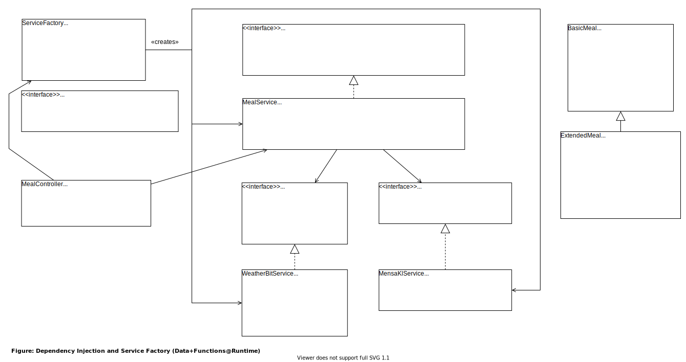

Note that for every service, there is an interface which can be implemented by a mock or fake service. All services get their dependencies in the constructor. This way, fake or mock services can be injected for testing purpose.

#### 5.1.3. Design decisions

Dependency injection is used for the three main services. The MealController (REST controller) uses the service from the service factory which currently returns the real (production) services. Thus, with the current concept, the REST controller cannot be tested with mock service. This is ok, since the drivers do not require testability on system or integration test level. If this is required in the future, different service factories (test, production) can be introduced.

#### 5.1.4. Discarded alternatives

In every service, one could read a system environment variable to switch between different service implementations. This approach, however, is prone to errors and less flexible, since one cannot easily run tests in parallel that use different service implementations.

### 5.2. Caching concept

#### 5.2.1. Architecture drivers

Main driver: _Q.Performance.Response_, i.e. a response time of &le; 200ms.

Related drivers: _Q.Size_ and _Q.Comprehensibility_.

#### 5.2.2. Solution idea  

We introduce an in-memory cache such that meals and weather data is only queried every 30 minutes.

The caching services act as bridges to the actual services.

The following diagram describes the behavior of the system when no data has been cached yet.

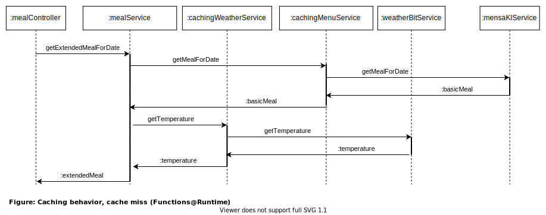

When cached data is available and not older than 30 minutes, data from the cache is used:

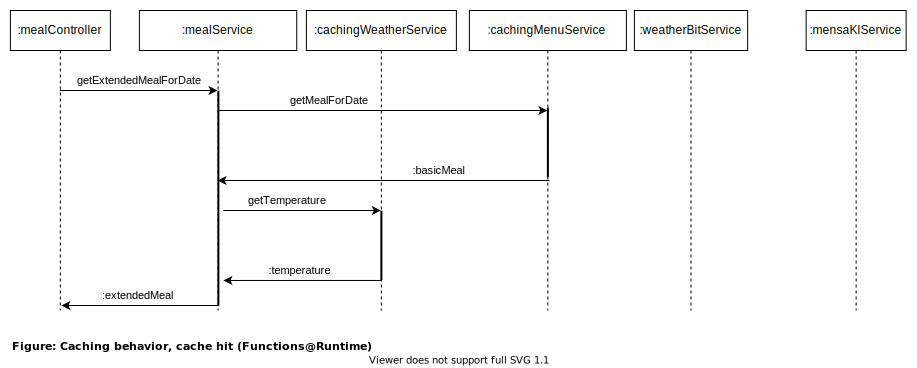

#### 5.2.3. Design decisions

Since weather and meal data do not change very frequently, we can cache them for at least 30 minutes. Furthermore, a simple, self-written solution is easier to comprehend for less experienced developers (cf. driver _Q.Comprehensibility_).

#### 5.2.4. Discarded alternatives

Other caching options include file system or database cache. This is discarded, since it makes the system much more complex. Also, the amount of data to be cached is very small and we only have one instance of the server running.

A typical, ready-to-use in-memory cache solution is [Ehcache](https://www.ehcache.org/). However, an inclusion of this library would increase the deployment artifact size with an additional 1.7 MB such that the requirements of driver _Q.Size_ will not be met anymore. Furthermore, it makes the code less easy to understand (cf. driver _Q.Comprehensibility_).

## 6. Risks and technical debt

It is assumed that the system is restarted at least once a month since, regarding the caching concept, cached data is held in memory forever which can result into extended memory usage when running the system for a longer time without restarting.

## 7. Outlook and future plans

It is planned to derive a template in both English and German based on this documentation. This template can then be used for any project and provide a light-weight and accessible architecture documentation.

## 8. Glossary

_cold bowl_: A cold bowl consist of fruit pieces, fruit juice and ice (and some more secret ingredients). This is a literal translation of the German word "Kaltschale".

_HTWG_: University of applied science in Konstanz, Germany.

_REST_: REpresential State Transfer, a commonly used web service design approach.

_Software-Architektur_: German for software architecture.

_WIN_: German abbreviation of the _Wirtschaftsinformatik_ study programm at HTWG. It means _business information technology_ in English - a course of studies that combines elements of computer science with business administration.
