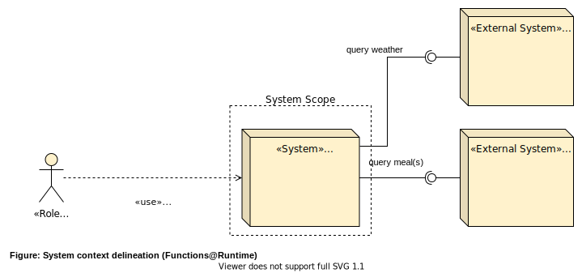

<!-- This reserves 30% of the slide width for the image on the right. The image itself is scaled to 80% size. -->

# What2Eat

## Presentation example (with Marp)

by Johannes Schneider

---

# A note on Marp

<!-- Das reserviert 40% der Folien-Breite für das Bild auf der linken Seite. Das Bild an sich wird auf 90% Größe skaliert -->

Marp (also known as the Markdown Presentation Ecosystem) provides an intuitive experience for creating beautiful slide decks. You only have to focus on writing your story in a Markdown document.

---

# Introduction

What2Eat is a simple app for showing the meal of the day at the cafeteria of the university of Kaiserslautern. It serves as an example for illustrating architecture design (part of the lecture "SWAR-WIN: Softwarearchitektur" by Prof. Dr. Johannes C. Schneider from [HTWG Konstanz](https://www.htwg-konstanz.de/)).

---

# Stakeholders

Stakeholders of this project and system are

- the teacher of the lecture _Software-Architektur_ (project lead),
- attendants of the lecture _Software-Architektur_, WIN and GIB students ("users" in terms of learning about software architecture) and
- potential cafeteria customers (end users).

---

# System context delineation

---

<!-- custom style to adapt the font size -->

# Driver Package Size

| Categorization  |                                                                                                                |                    |
| --------------- | -------------------------------------------------------------------------------------------------------------- | ------------------ |
| Scenario Name     | Package Size                                                                                                   |        |                 |
| Scenario ID       | Q.Size                                                                                                         |
| **Description** |                                                                                                                | **Quantification** |
| Environment     | The code is ready for a new deployment.                                                                        |                    |
| Stimulus        | A new deployment artifact is built to update the production app.                                               |                    |
| Response        | In order to make the deployment from places with weak internet connection, the deployment artifact has size S. | S &le; 3 MB        |

---

<!--- This pictures is taken as full background -->

